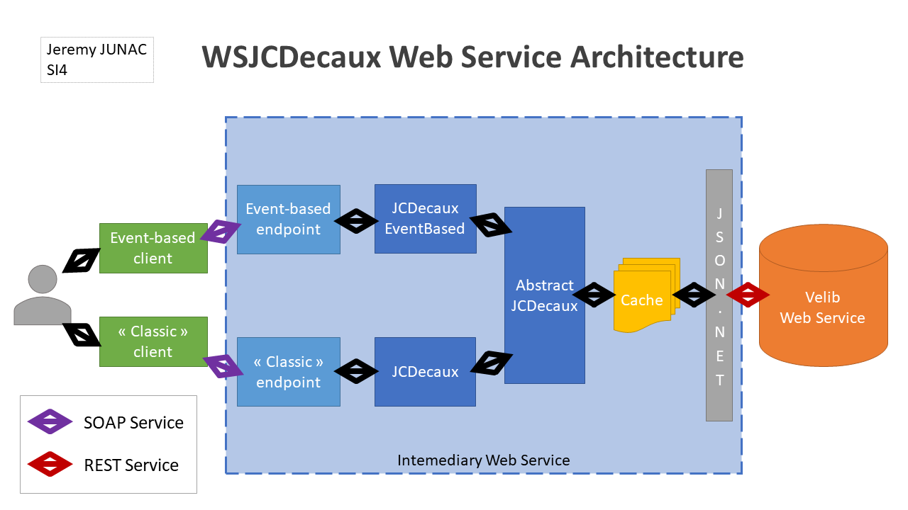
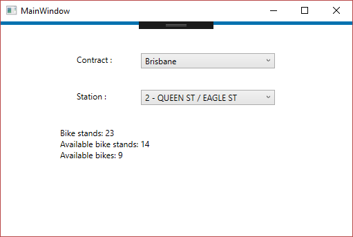

# Velib Gateway Web Service
### REST and SOAP WS Lab

- [Velib Gateway Web Service](#velib-gateway-web-service)
        - [REST and SOAP WS Lab](#rest-and-soap-ws-lab)
    - [Architecture](#architecture)
    - [Usage](#usage)
    - [Structure description](#structure-description)
    - [Extensions](#extensions)
        - [Development](#development)
        - [Deployment](#deployment)
        - [Monitoring](#monitoring)
    - [Description](#description)
        - [MVP](#mvp)
        - [GUI client](#gui-client)
        - [Asynchronous calls](#asynchronous-calls)
        - [Cache](#cache)
    - [Event-based lab](#event-based-lab)

## Architecture



_See the PDF version [here](architecture.pdf)_

## Usage

First clone the repository:
```
git clone https://github.com/Taken0711/WSJCDecaux.git
```

To run this project, open the solution `WSJCDecaux.sln` with Visual Studio 2017, set one of the client as startup project and click `Run`

## Structure description

 * `CLIClient`: The command-line interface client for querying the Intermediary Web Service
 * `GUIClient`: The graphical client for the [Graphical User Interface extension](#gui-client)
 * `EventBasedClient`: The CLI client for the [Event-based lab](#event-based-lab)
 * `WSJCDecaux`: The SOAP Intermediary Web Service

## Extensions

Validated extension will be detailed in the [Description paragraph](#description).

### Development
 - [X] Graphical User Interface for the client
 - [X] Asynchronous calls between GUI client and IWS (the CLI client is **SYNCHRONOUS**)
 - [X] Cache system between IWS and JCDecaux service with configurable timestamp

### Deployment
 - [ ] Docker

### Monitoring
 - [ ] Various indicators

## Description

### MVP

The CLI client can be used as follow:

```
Available commands:
        exit - exit the client
        help - display this
        list-contracts - list all the contracts
        list-stations CONTRACT [NAME_FILTERS...] - list the stations filtered by name and its available bike for a contract
```

### GUI client



### Asynchronous calls

Only the GUI client makes asynchronous call. Indeed, asynchonous call are not really useful in a CLI client.

### Cache

The IWS has a cached to limit the qery to the JCDecaux web service. The life time of the cache is configurable via the `GET` request. Thus to enhance this, the GUI client and the CLI client have a different cache life time. There are set respectively to 1 minute and 3 minutes.

## Event-based lab

The IWS now offer a subscribe method. You have to give a contract, a station and a timeout for the refresh to the web service.

The `EventBasedClient` implement the new functionality with the `subscribe`:

```
subscribe CONTRACT [NAME_FILTERS...]
```